# Talastock ETL Data Platform

> An end-to-end data engineering platform built for a Filipino SME — from raw synthetic data all the way to ML-powered sales forecasting and a live analytics dashboard.

---

## Overview

Talastock Data Platform demonstrates a complete modern data stack:

- **5 automated Airflow pipelines** that chain end-to-end
- **PostgreSQL data warehouse** with a 3-layer architecture (raw → staging → analytics)
- **dbt** with 9 models and 104 automated data quality tests
- **OLS forecasting model** generating 30-day revenue predictions per category
- **Next.js analytics dashboard** with pipeline controls, quality observability, and forecast charts

---

## Tech Stack

| Layer | Technology |
|---|---|
| Data Generation | Python · Faker · Pandas · NumPy |
| Orchestration | Apache Airflow 2.9 (Docker) |
| Data Warehouse | PostgreSQL 13 (Docker) |
| Transformations | dbt Core 1.7 |
| Forecasting | NumPy — OLS linear regression |
| Dashboard | Next.js 14 · TypeScript · Recharts |
| DB Management | pgAdmin 4 |

---

## Pipeline Architecture

```
┌──────────────────────────────────────────────────────────────────┐
│  [1] data_generator_pipeline                                     │
│       Generates 10,000 synthetic Filipino sales transactions     │
│       with realistic patterns (payday, peak hours, weekends)     │
└─────────────────────────┬────────────────────────────────────────┘
                          │ auto-triggers
┌─────────────────────────▼────────────────────────────────────────┐
│  [2] sales_etl_pipeline                                          │
│       Cleans raw CSVs — deduplication, type coercion,            │
│       NaN filtering, quality report                              │
└─────────────────────────┬────────────────────────────────────────┘
                          │ auto-triggers
┌─────────────────────────▼────────────────────────────────────────┐
│  [3] warehouse_etl_pipeline                                      │
│       Loads data into PostgreSQL: raw → staging → star schema    │
│       Builds dims, fact table, and 3 aggregate tables            │
└─────────────────────────┬────────────────────────────────────────┘
                          │ auto-triggers
┌─────────────────────────▼────────────────────────────────────────┐
│  [4] dbt_pipeline                                                │
│       Rebuilds 9 dbt models · Runs 104 data quality tests        │
│       Generates lineage documentation                            │
└─────────────────────────┬────────────────────────────────────────┘
                          │ auto-triggers
┌─────────────────────────▼────────────────────────────────────────┐
│  [5] forecasting_pipeline                                        │
│       OLS linear trend per category + business multipliers       │
│       Writes 30-day forecasts with 80% confidence interval       │
└──────────────────────────────────────────────────────────────────┘
```

---

## Airflow — Pipeline Orchestration

### All 5 DAGs

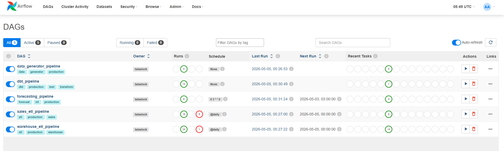

### Pipeline 1 — Data Generator

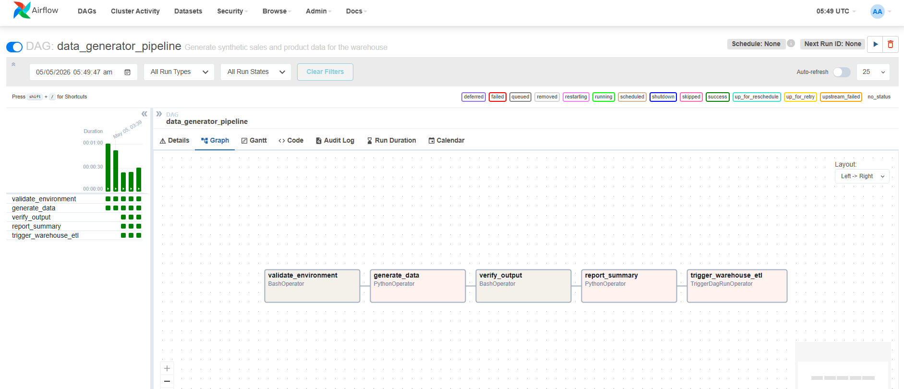

### Pipeline 2 — Sales ETL


### Pipeline 3 — Warehouse ETL

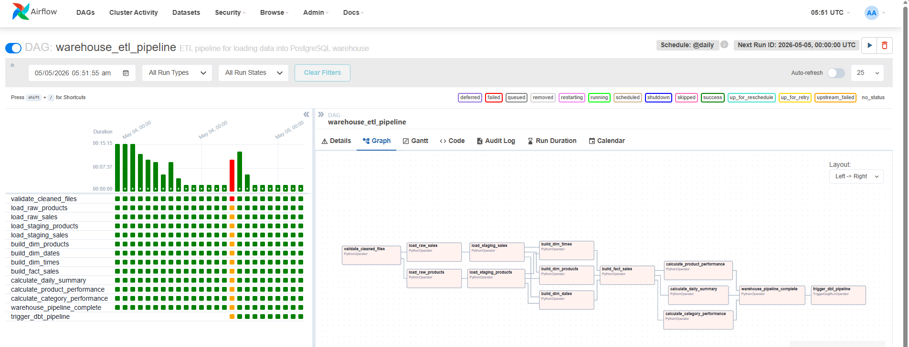

### Pipeline 4 — dbt Transform

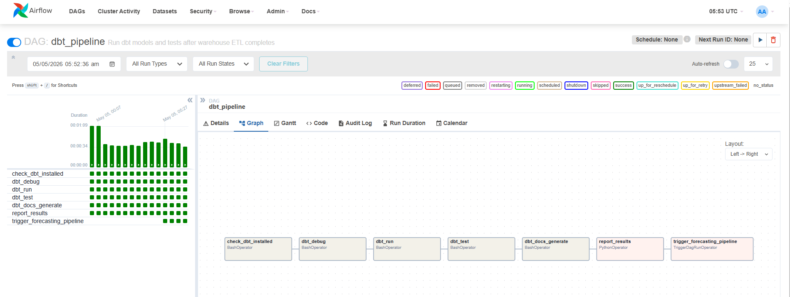

### Pipeline 5 — Forecasting

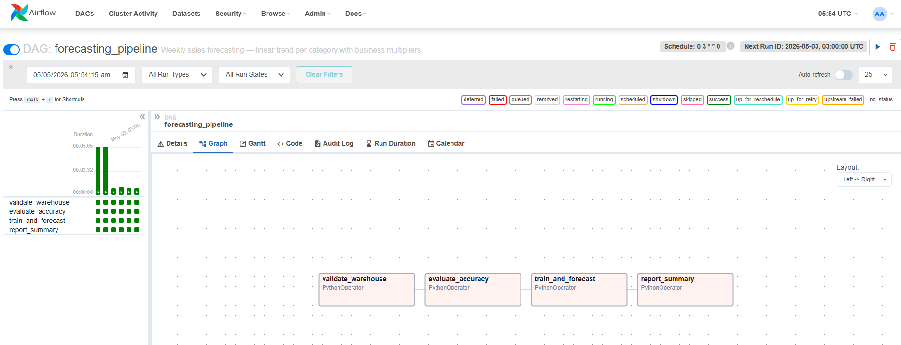

---

## Analytics Dashboard

### Overview — Revenue KPIs and trends

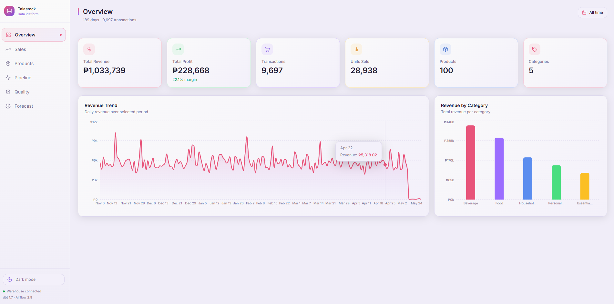

### Sales — Daily patterns, payment methods, hourly breakdown

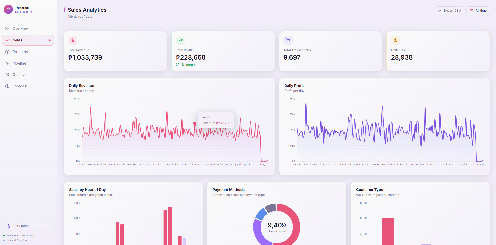

### Pipeline — Status, controls, and DAG trigger panel

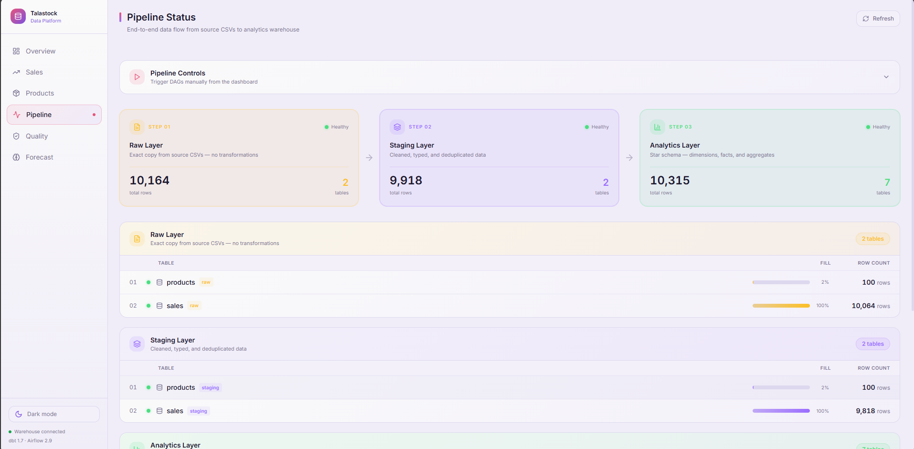

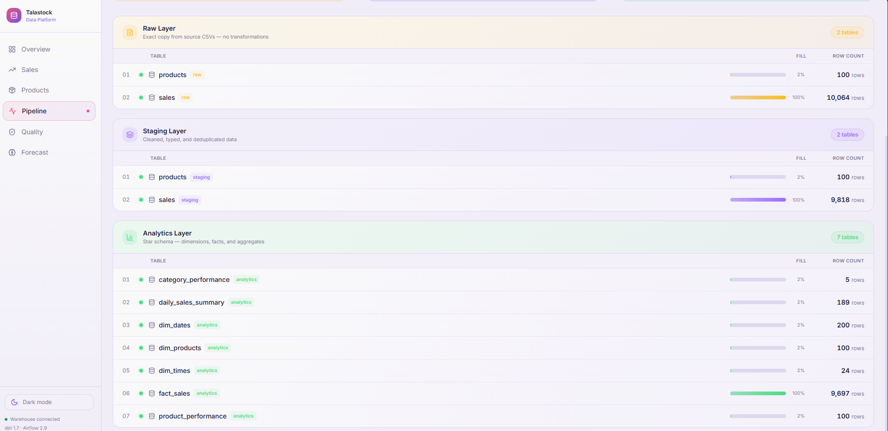

### Quality — Table health, freshness, DAG run history, dbt test inventory

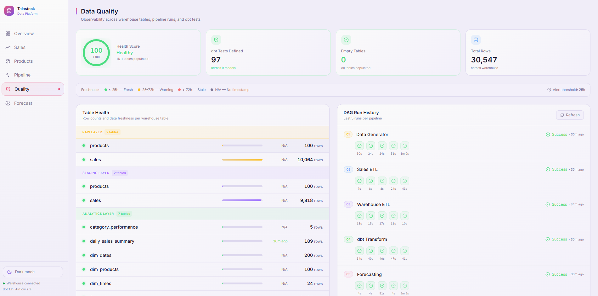

### Forecast — 30-day revenue predictions per category

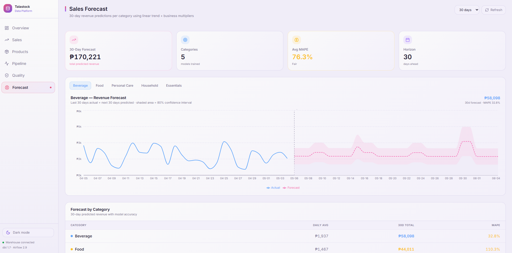

---

## Data Warehouse — pgAdmin

### Schema overview (raw · staging · analytics)

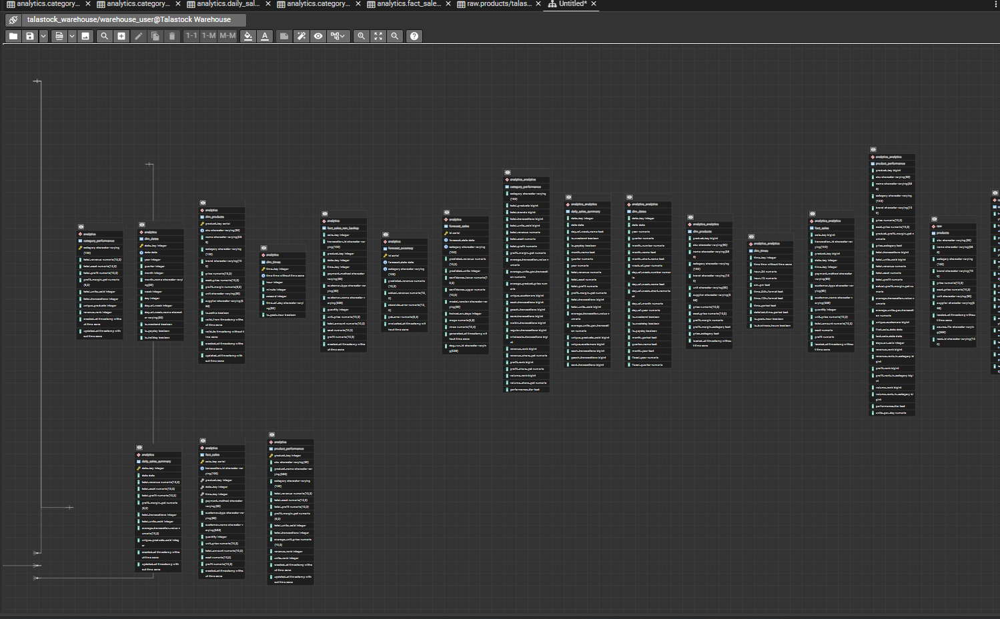

---

## Data Warehouse Schema

### Three-layer architecture

```
raw.*          Exact copy of source CSVs — no transformations, full audit trail
staging.*      Cleaned, typed, deduplicated — business rules applied
analytics.*    Star schema — optimised for BI queries
```

### Star schema

```
         dim_products (100 rows)
              │
dim_dates ── fact_sales (~9,700 rows) ── dim_times (24 rows)
              │
    daily_sales_summary
    product_performance
    category_performance
    forecast_sales
    forecast_accuracy
```

---

## dbt Models

9 models · 104 data quality tests

```
raw.products / raw.sales
        │
   stg_products / stg_sales          (views)
        │
   dim_products / dim_dates / dim_times   (tables)
        │
   fact_sales                         (table)
        │
   daily_sales_summary / product_performance / category_performance
```

---

## Forecasting Model

- **Algorithm**: Ordinary Least Squares linear regression on 90 days of daily revenue
- **Multipliers**: weekend ×1.20 · payday (15th/30th/31st) ×1.50
- **Interval**: 80% prediction interval from residual standard deviation
- **Metrics**: MAPE and RMSE logged per category per run
- **Schedule**: Weekly retraining every Sunday at 03:00
- **Dependencies**: NumPy only — no external ML libraries

---

## Quick Start

### 1. Start the warehouse

```bash
cd warehouse
docker-compose up -d
```

### 2. Start Airflow

```bash
cd airflow

# Windows
.\start-airflow.ps1

# Mac / Linux
export AIRFLOW_UID=50000
docker-compose up -d
```

### 3. Access the tools

| Tool | URL | Login |
|---|---|---|
| Airflow | http://localhost:8080 | admin / admin |
| pgAdmin | http://localhost:5050 | admin@talastock.com / admin |
| Dashboard | http://localhost:3001 | — |

### 4. Run the full pipeline

Trigger `data_generator_pipeline` in the Airflow UI — it chains through all 5 stages automatically.

### 5. Start the dashboard

```bash
cd analytics-dashboard
npm install
npm run dev
```

---

## Project Structure

```
data-platform/
├── README.md
├── CONTRIBUTING.md
│
├── docs/                            ← all guides
│   ├── 01_SETUP.md
│   ├── 02_PIPELINE_DATA_GENERATOR.md
│   ├── 03_PIPELINE_SALES_ETL.md
│   ├── 04_PIPELINE_WAREHOUSE_ETL.md
│   ├── 05_PIPELINE_DBT.md
│   ├── 06_PIPELINE_FORECASTING.md
│   ├── 07_TROUBLESHOOTING.md
│   └── visuals/                     ← screenshots
│
├── data-generator/                  ← synthetic data generation
├── airflow/                         ← DAGs + Docker setup
├── warehouse/                       ← schema SQL + pgAdmin setup
├── dbt/                             ← models, tests, profiles
├── analytics-dashboard/             ← Next.js UI
└── scripts/                         ← data quality utilities
```

---

## Documentation

| Guide | What it covers |
|---|---|
| [Setup](docs/01_SETUP.md) | Prerequisites, Docker, first run |
| [Data Generator](docs/02_PIPELINE_DATA_GENERATOR.md) | Synthetic data, patterns, output files |
| [Sales ETL](docs/03_PIPELINE_SALES_ETL.md) | Cleaning, transformations, NaN handling |
| [Warehouse ETL](docs/04_PIPELINE_WAREHOUSE_ETL.md) | 3-layer load, star schema build |
| [dbt](docs/05_PIPELINE_DBT.md) | Models, 104 tests, local dev commands |
| [Forecasting](docs/06_PIPELINE_FORECASTING.md) | OLS model, multipliers, output tables |
| [Troubleshooting](docs/07_TROUBLESHOOTING.md) | Common issues and fixes |
| [Concepts & Tools](docs/08_CONCEPTS_AND_TOOLS.md) | Deep explanation of every tool and concept |

---

## License

MIT — see [LICENSE](LICENSE)

## Author

**MJ Tuplano** · [@MjTuplano18](https://github.com/MjTuplano18)
