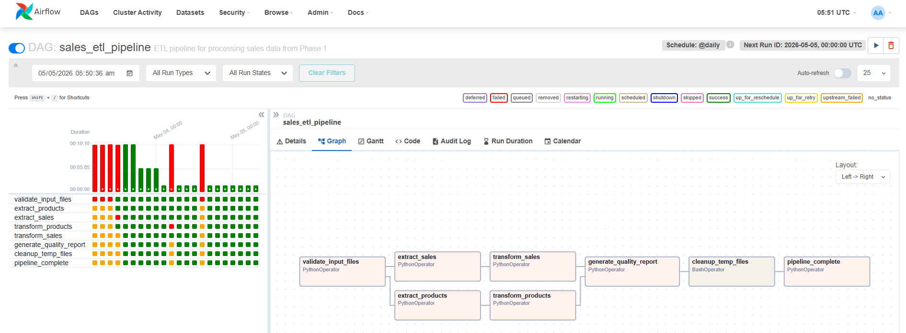

# Pipeline 2 — Sales ETL

**DAG ID**: `sales_etl_pipeline`  
**Schedule**: `@daily` (midnight)  
**Triggered by**: `data_generator_pipeline` on success  
**Triggers**: `warehouse_etl_pipeline` on success  
**File**: `airflow/dags/sales_etl_pipeline.py`

---

## What it does

Reads the raw CSV files produced by the data generator, cleans and transforms them, and writes the results to the `processed/` directory. This is the Extract + Transform half of the ETL — the Load happens in the next pipeline.

This pipeline demonstrates real-world ETL patterns: parallel extraction, data type coercion, deduplication, validation, and quality reporting.

---

## Task flow

```
validate_input_files
         │
    ┌────┴────┐
extract_products  extract_sales      ← parallel
    │                  │
transform_products  transform_sales  ← parallel
    └────┬────┘
         │
generate_quality_report
         │
  cleanup_temp_files
         │
  pipeline_complete
         │
trigger_warehouse_etl
```



Tasks in the same row run **in parallel** because they don't depend on each other. This is a core Airflow pattern — always parallelise independent work.

---

## Task details

### validate_input_files
Checks that `products.csv` and `sales_standard.csv` exist and are readable. Fails the pipeline immediately if either is missing — no point running the rest.

### extract_products / extract_sales
Reads each CSV into a Pandas DataFrame and saves it to a temporary file. Logs row count, column names, and memory usage.

### transform_products
| Transformation | Detail |
|---|---|
| Remove duplicates | Deduplicate on SKU |
| Fill missing values | Category → "Uncategorized", Brand → "Generic" |
| Fix data types | price, cost_price → numeric; stock_quantity → int |
| Remove invalid rows | Drop rows where price < 0 |
| Add calculated field | `profit_margin = ((price - cost_price) / price) * 100` |

Output: `data-generator/processed/products_cleaned.csv`

### transform_sales
| Transformation | Detail |
|---|---|
| Parse dates | Convert `timestamp` column to datetime |
| Drop unparseable dates | Remove rows where date conversion fails |
| Fix data types | quantity → int; unit_price, total_amount → numeric |
| Remove invalid rows | Drop negative amounts and zero quantities |
| Add time fields | Extract year, month, day_of_week, hour |
| Recalculate totals | Ensure `total_amount = quantity × unit_price` |

Output: `data-generator/processed/sales_cleaned.csv`

### generate_quality_report
Produces a JSON summary of the cleaned data:

```json
{
  "generated_at": "2026-05-05T10:00:00",
  "products": {
    "total_count": 100,
    "categories": 5,
    "brands": 15,
    "avg_price": 125.50,
    "avg_profit_margin": 35.2
  },
  "sales": {
    "total_count": 9950,
    "total_revenue": 1056894.56,
    "avg_transaction": 106.22,
    "date_range": { "start": "2025-11-01", "end": "2026-04-30" }
  }
}
```

Output: `data-generator/processed/quality_report.json`

### cleanup_temp_files
Deletes `temp_products.csv` and `temp_sales.csv` to keep the filesystem clean.

---

## Input / output

| | Path |
|---|---|
| Input products | `data-generator/output/products.csv` |
| Input sales | `data-generator/output/sales_standard.csv` |
| Output products | `data-generator/processed/products_cleaned.csv` |
| Output sales | `data-generator/processed/sales_cleaned.csv` |
| Quality report | `data-generator/processed/quality_report.json` |

---

## Data quality checks performed

**Products**
- No duplicate SKUs
- No missing categories or brands
- All prices positive
- Profit margins calculated

**Sales**
- All dates valid and parseable
- No negative amounts
- All quantities positive
- `total_amount` matches `quantity × unit_price`
- Time-based fields extracted

---

## Why NaN values exist in raw/staging

The data generator intentionally introduces ~5% wrong data types (e.g. `"₱50.00"` as a string). When Pandas converts these with `pd.to_numeric(errors='coerce')`, values it can't parse become `NaN`.

- `"50"` → `50.0` ✅
- `"₱50.00"` → `50.0` ✅ (after stripping `₱`)
- `"fifty"` → `NaN` ❌
- `"₱1,234.00"` → `NaN` ❌ (comma causes failure)

These NaN rows are preserved in the raw and staging layers for audit purposes. They are filtered out automatically when building `fact_sales` in the warehouse ETL.

**Result**: ~1.4% of transactions are unusable. The analytics layer has 0 NaN values.
